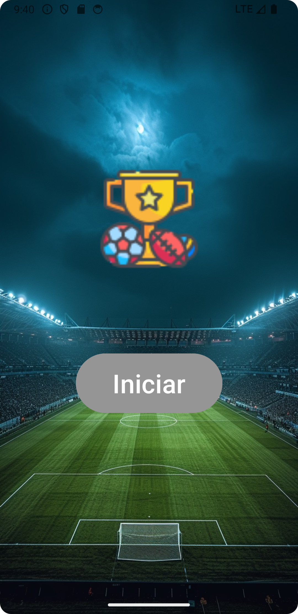
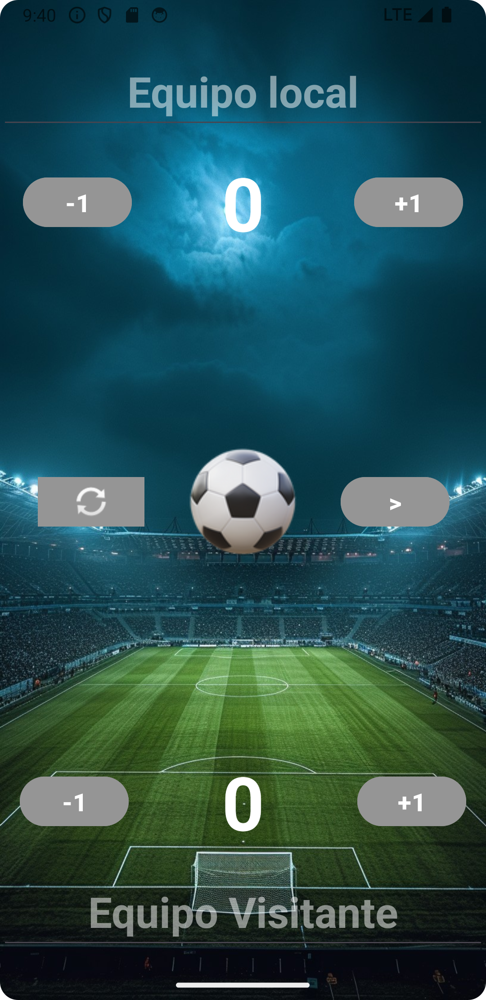
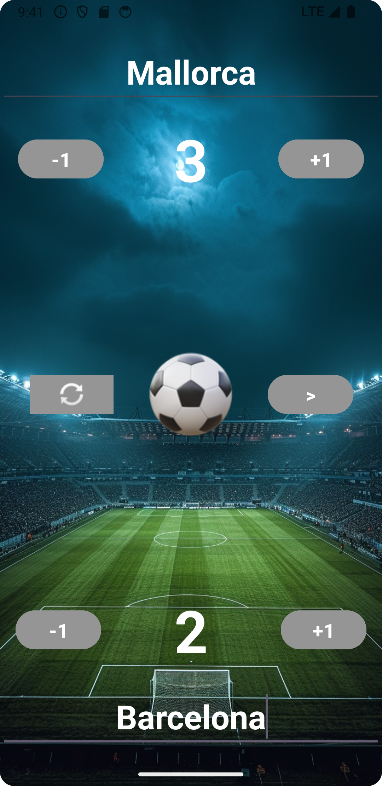
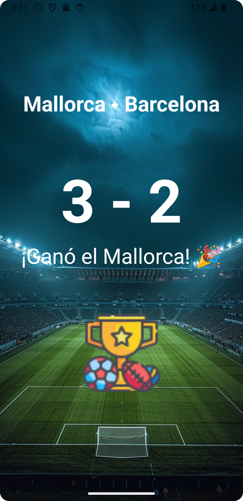

# Football Marker App

## Descripción
La aplicación Football Score es una herramienta sencilla para llevar el control del marcador de un partido de fútbol. Permite incrementar y decrementar los puntos de dos equipos y muestra un resumen del resultado al final del juego.

## Características
- Incrementar y decrementar la puntuación del equipo local.
- Incrementar y decrementar la puntuación del equipo visitante.
- Reiniciar las puntuaciones de ambos equipos a cero.
- Visualizar un resumen del resultado final y el nombre de los equipos.
- Notificación del equipo ganador o si fue un empate.

## Capturas de Pantalla

*Pantalla de inicio de la aplicación.*


*Pantalla con los marcadores a 0 y los campos de texto vacíos.*


*Pantalla con los marcadores actualizados y los nombres de los equipos.*


*Pantalla final mostrando el resultado del partido.*

## Video Demostrativo
Mira el video demostrativo de la aplicación en funcionamiento:

[](https://www.youtube.com/watch?v=-ZKFKXapPP8)

## Instalación

### Prerrequisitos
- [Android Studio](https://developer.android.com/studio)
- [Java Development Kit (JDK)](https://www.oracle.com/java/technologies/javase-jdk11-downloads.html) 11 o superior
- Conexión a Internet para descargar dependencias

### Paso a Paso

1. Clona el repositorio:
    ```sh
    git clone https://github.com/usuario/nombre-del-repositorio.git
    ```
2. Navega al directorio del proyecto:
    ```sh
    cd nombre-del-repositorio
    ```
3. Abre el proyecto en Android Studio.
4. Sincroniza las dependencias del proyecto (Android Studio normalmente te pedirá que lo hagas automáticamente).
5. Ejecuta la aplicación en un emulador o dispositivo físico conectando tu dispositivo y seleccionando `Run` > `Run 'app'`.

## Uso
1. Al iniciar la aplicación, presiona el botón "Start" para ir a la pantalla principal de puntajes.
2. Usa los botones para incrementar o decrementar las puntuaciones de los equipos local y visitante.
3. Presiona el botón de reinicio para restablecer ambas puntuaciones a cero.
4. Presiona el botón de guardar para ver un resumen del resultado y determinar el equipo ganador o si fue un empate.

## Estructura del Proyecto
- **MainActivity**: La actividad principal que inicia la aplicación.
- **FirstActivity**: La actividad que contiene la lógica para manejar los puntajes de los equipos.
- **DetailActivity**: La actividad que muestra el resumen del resultado final del juego.
- **MainViewModel**: ViewModel que maneja la lógica y el estado de las puntuaciones de los equipos.

## Contribución
1. Haz un fork del proyecto.
2. Crea una nueva rama (`git checkout -b feature/nueva-caracteristica`).
3. Realiza los cambios necesarios y haz commit (`git commit -am 'Añadir nueva característica'`).
4. Envía los cambios a tu repositorio fork (`git push origin feature/nueva-caracteristica`).
5. Abre un Pull Request.

## Licencia
Este proyecto está licenciado bajo la Licencia MIT - consulta el archivo [LICENSE](LICENSE) para más detalles.

## Contacto
- Autor: Gerard Luque Oliver
- Correo Electrónico: [gerard.luque.oliver@gmail.com](mailto:gerard.luque.oliver@gmail.com)
- LinkedIn: [Gerard Luque](www.linkedin.com/in/gerardluque)

